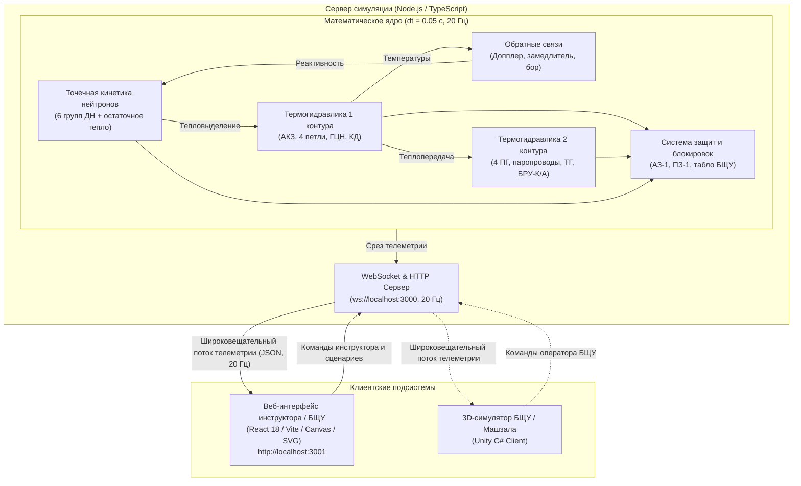

# Архитектура учебно-тренировочного комплекса ВВЭР-1200

> **Проект**: Учебно-тренировочный комплекс «Тренажер оператора энергоблока ВВЭР-1200»  
> **Тип реакторной установки**: ВВЭР-1200 (проект АЭС-2006 / В-392М / В-491)  
> **Версия архитектуры**: 1.0  
> **Статус**: Активная разработка  

---

## 1. Обзор архитектуры системы

Комплекс построен по клиент-серверной модульной схеме с разделением вычислительного физического ядра и визуализационных клиентских оболочек (панель инструктора/экзаменатора на React, потенциальный 3D-клиент на Unity).



---

## 2. Математическое ядро симуляции

Математическая модель представляет собой систему детерминированных обыкновенных дифференциальных уравнений (ОДУ), решаемых методом численного интегрирования первого и второго порядков с фиксированным шагом квантования времени $\Delta t = 0.05$ с ($50$ мс):

### 2.1. Нейтронно-физический блок
- **Точечная кинетика с 6 группами запаздывающих нейтронов**:
  $$\frac{dn(t)}{dt} = \frac{\rho(t) - \beta}{\Lambda} n(t) + \sum_{i=1}^6 \lambda_i C_i(t)$$
  $$\frac{dC_i(t)}{dt} = \frac{\beta_i}{\Lambda} n(t) - \lambda_i C_i(t), \quad i=1,\dots,6$$
- **Остаточное энерговыделение (модель ANS-5.1 / 3 экспоненциальные группы)**: обеспечивает реалистичную динамику спада тепла после сброса аварийной защиты АЗ-1.
- **Уравнение баланса реактивности**:
  $$\rho(t) = \rho_{\text{СУЗ}}(h) + \alpha_{\text{fuel}} \cdot \Delta T_{\text{fuel}} + \alpha_{\text{cool}} \cdot \Delta T_{\text{cool}} + \alpha_{\text{boron}} \cdot \Delta C_B$$
  - Допплер-эффект топлива ($\alpha_{\text{fuel}} < 0$) — мгновенная отрицательная обратная связь;
  - Температурный коэффициент теплоносителя ($\alpha_{\text{cool}} < 0$) — саморегулирование реактора;
  - Борное регулирование ($\alpha_{\text{boron}}$) — медленное управление запасом реактивности.

### 2.2. Термогидравлика первого контура (ВВЭР-1200)
- **Активная зона**: расчет усредненных температур топливных таблеток ($T_{\text{fuel}}$), оболочек ТВЭЛ и теплоносителя на входе/выходе реактора ($T_{\text{in}} \approx 298.2^\circ\text{C}$, $T_{\text{out}} \approx 328.9^\circ\text{C}$).
- **4 циркуляционные петли**: индивидуальный расчет расхода через каждую петлю в зависимости от статуса и частоты вращения соответствующего ГЦН-1391.
- **Компенсатор давления (КД объемом 79 м³)**:
  - Двухфазная модель (пар/вода);
  - Электронагреватели (ТЭН суммарной мощностью до $2.52$ МВт) для компенсации падения давления;
  - Система впрыска «холодного» теплоносителя из холодной нитки для подавления скачков давления выше $16.2$ МПа;
  - Предохранительные клапаны (ИПУ КД).

### 2.3. Второй контур и турбоустановка
- **4 горизонтальных парогенератора ПГВ-1000МКП**:
  - Моделирование парообразования насыщенного пара ($P_2 \approx 7.0$ МПа, $T_{\text{sat}} \approx 285.8^\circ\text{C}$);
  - Баланс уровня котловой воды и расхода питательной воды;
- **Турбоагрегат К-1200-6.8/50 (быстроходная турбина + генератор)**:
  - Регулирующие клапаны турбины (РК ТП) и стопорные клапаны (СК ТП);
  - Выработка электрической мощности ($N_{\text{эл}} \approx 1200$ МВт при $N_{\text{тепл}} = 3200$ МВт, КПД брутто $\approx 37.5\%$);
  - Быстродействующие редукционные установки со сбросом пара в конденсаторы (БРУ-К) и в атмосферу (БРУ-А).

### 2.4. Система аварийных защит (АЗ-1 / ПЗ-1)
- **АЗ-1 (Аварийная защита 1-го рода)**: немедленный гравитационный сброс всех поглощающих стержней СУЗ в крайнее нижнее положение со скоростью $1.2$ м/с при превышении критических параметров (давление первого контура $> 17.8$ МПа, падение расхода через петли, превышение мощности $> 107\%$).
- **ПЗ-1 (Предупредительная защита)**: пошаговое снижение мощности до безопасного уровня.

---

## 3. Архитектура клиентской части (React)

Веб-приложение построено на базе компонентной архитектуры React 18:
- **`PlantMimic`**: Высокодетализированная интерактивная SVG/CSS мнемосхема энергоблока ВВЭР-1200:
  - Реакторный сосуд с анимацией погружения стержней СУЗ;
  - Компенсатор давления со столбиком уровня и индикатором нагревателей/впрыска;
  - 4 петли с индикаторами ГЦН (вращение/останов) и теплопередачи;
  - Парогенератор с уровнем зеркала испарения;
  - Турбина со скоростью вращения ротора и генератор, подключенный к энергосети.
- **`AnnunciatorPanel`**: Светосигнальное табло БЩУ (матрица ламп аварийных и предупредительных сигнализаций с миганием при квитировании).
- **`FaultInjectionPanel`**: Пульт экзаменатора для имитации аварийных ситуаций:
  - «Отключение ГЦН-2»;
  - «Рост давления первого контура (отказ КД)»;
  - «Снижение расхода питательной воды / падение уровня ПГ»;
  - «Отключение турбогенератора от сети»;
  - «Ручной сброс аварийной защиты АЗ-1»;
  - «Сброс блока в номинал 100%».
- **`TelemetryCharts` & `KPI Cards`**: Цифровые приборы и графики переходных процессов реального времени.
- **`EventLogger`**: Протокол сессии с категоризацией (Инструктор, Оператор, Система, Авария) и экспортом в CSV/JSON.

---

## 4. Сетевой стек и синхронизация

```
[Симулятор (Server)] --- (20 раз/сек) ---> [WebSocket Broadcast] ---> [React State (useRef + Throttle)]
                                                                                |
                                                                                v
                                                                   [Canvas / SVG Re-render 60fps]
```
Сетевое взаимодействие оптимизировано для низких задержек (< 10 мс по локальной сети):
1. **Телеметрия**: JSON-пакет размером ~1.5 КБ транслируется подключенным клиентам каждые 50 мс.
2. **Команды**: отправляются мгновенно клиентом в WebSocket-канал либо через HTTP POST `/api/command`.
